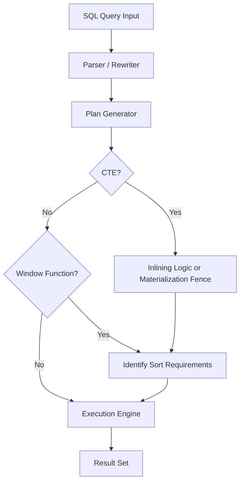

# CTEs in PostgreSQL: Window Functions vs CTEs

This project sets up a PostgreSQL 15 benchmarking environment for comparing window functions, CTEs, recursive traversal, and materialized views on a large synthetic analytics dataset.

## Contents

- `docker-compose.yml` and `Dockerfile` for a one-command PostgreSQL stack.
- `docker/init/` SQL scripts that create the schema and seed 200,000 users and 1,000,000 orders automatically on first startup.
- `queries/` with both `window_*.sql` and `cte_*.sql` variants for the five analytics problems plus the recursive referral query and the materialized-view definition.
- `benchmarks/` for `EXPLAIN ANALYZE` captures, `pgbench` scripts, and the performance report.
- `results/benchmarks.json` for summarized metrics.

## Start

1. Copy `.env.example` to `.env` and set a strong password.
2. Run `docker compose up -d`.
3. Wait for the database healthcheck to report healthy.

The first startup seeds the data and creates the `daily_revenue_stats` materialized view.

## Query suite

1. Query 1: 7-day rolling revenue average for the last 90 days.
2. Query 2: Top 10 spenders per signup-month cohort.
3. Query 3: First and last order per user.
4. Query 4: Customers with declining order volume.
5. Query 5: Per-order contribution to lifetime spend.
6. Recursive referrals: maximum referral-chain depth for the top 100 users by order count.

## Benchmark workflow

Run `python scripts/run_benchmark_suite.py` after the database is healthy.

The script records:

- `EXPLAIN (ANALYZE, BUFFERS, FORMAT JSON)` for all query variants.
- Index impact for Query 1 and Query 2 after applying the requested B-tree indexes.
- `pgbench` throughput and latency for Query 1 and Query 2 with 10 concurrent clients for 60 seconds.
- Materialized-view creation, refresh, and read timings.

## Screenshots

Save the Dalibo renders in `benchmarks/visual-plans/` using these names:

- `query_1_window.png`
- `query_1_cte.png`
- `query_2_window.png`
- `query_2_cte.png`
- `query_3_window.png`
- `query_3_cte.png`
- `query_4_window.png`
- `query_4_cte.png`
- `query_5_window.png`
- `query_5_cte.png`
- `recursive_referrals.png`

The screenshot should show the rendered plan graph and execution time, not the parse error screen.

## Results

| Query | Window ms | CTE ms | Index speedup |
| --- | ---: | ---: | ---: |
| Q1 | 320.739 | 1253.170 | 1.492x |
| Q2 | 3195.046 | 12325.532 | 1.182x |
| Q3 | 4606.792 | 4554.318 | 1.000x |
| Q4 | 1778.197 | 2270.939 | 1.000x |
| Q5 | 3941.794 | 3641.930 | 1.000x |

| pgbench | Window | CTE |
| --- | ---: | ---: |
| Q1 TPS | 12.275 | 4.554 |
| Q1 latency ms | 814.636 | 2196.063 |
| Q2 TPS | 2.918 | 0.970 |
| Q2 latency ms | 3426.512 | 10311.375 |

## Recursive vs Window analysis

The referral problem is inherently recursive because each user can point to a parent, and that parent can point to another parent. Window functions operate over a fixed partition and an ordered frame; they can rank, aggregate, or compare rows already present in the set, but they cannot continue traversing an unknown-depth graph. `WITH RECURSIVE` is the correct tool because it repeatedly expands the frontier until the chain ends.

For this dataset, users with no referral parent are assigned depth `1` in the recursive query, which keeps the result stable and easy to compare across outputs. That convention is consistent with the query logic in [queries/recursive_referrals.sql](queries/recursive_referrals.sql).

